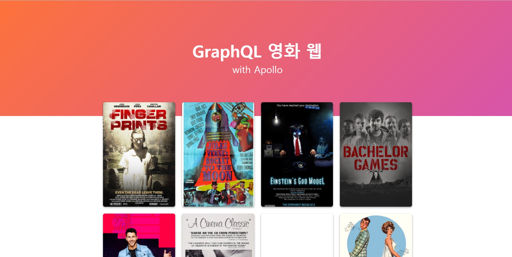
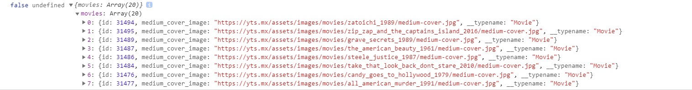
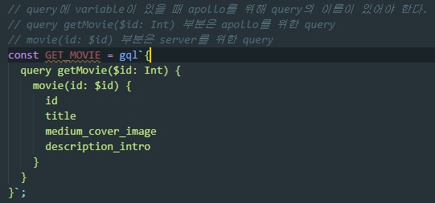

# GraphQL로 영화 웹 앱 만들기

## 결과 화면

 

> GraphQL로 만든 영화 API를 이용하기 위해 포트 서버를 실행해 준다.  
> 4000번 포트를 Apollo의 uri로 지정해 JSON및 Query를 받아온다.  
> **받아온 결과**  
>   
> [GraphQL로 만든 영화 API 링크](https://github.com/Juferis/for-practice/tree/master/movieql)
>
> 받은 Query를 이용해 영화의 포스터를 띄워주고 포스터를 클릭하면,  
> /:id 페이지로 넘어가 상세 정보를 알려준다.

## 1.0 참고 및 사용 기술

### 1.1 사용 기술

> GraphQL v15.5.0  
> React v17.0.2  
> @apollo/react-hooks v4.0.0  
> apollo-boost v0.4.9  
> react-router-dom v5.2.0  
> styled-components v5.3.0

### 1.2 참고

> **Apollo**  
> Apollo Client in your React app 설명 [링크](https://www.apollographql.com/docs/react/get-started/)  
> apollo-boost : GraphQl Yoga처럼 모든 것을 다 설정해 둔 패키지
> React Apollo는 사용자가 어떤 페이지를 보고 있었는지에 대한 정보를 캐시에 저장한다.  
> 그래서 다시 request를 보내지 않아도 되기에 로딩을 덜 보게된다.
>
> **styled-components** > [styled-components](https://hellominchan.tistory.com/99)  
> JS 파일 내에서 CSS를 사용할 수 있게 해주는 React 프레임워클 주요 대상으로 하는 라이브러리
>
> **Link**  
> <a href={link}>는 React App을 죽게 만들기에 react-router-dom의 Link를 사용
>
> **Apollo의 query**  
> query에 variable이 있을 때 apollo를 위해 query의 이름이 있어야 한다.  
> apollo가 변수의 타입($id: Int)을 검사하도록 도와준다.  
> 
>
> Optional Chaining[링크](https://developer.mozilla.org/ko/docs/Web/JavaScript/Reference/Operators/Optional_chaining)  
> "?." 연산으로 체이닝과 유사하지만 검사를 할 수 있다.(검사 코드의 길이가 줄어든다)

### 1.2 주의점

> Graphql API 서버를 실행 시킨 후 사용할 것  
> API_URL = "https://yts-proxy.nomadcoders1.now.sh/list_movies.json" API링크를 수정한다.

 

## 2.0 에러

### GraphQL '$' Error

>   
> Detail.js의 GET_MOVIE query문에서 에러가 발생했다.  
> query를 잘못 작성해서 생기는 오류 였고
>
>   
> 위의 이미지에서 커서가 위치한 부분 gql`{ query getMovie()...}'; 부분에 문제가 있었다.  
> query를 중괄호로 감싸지 않고 입력을 해야 query가 올바르게 작동되었다.
